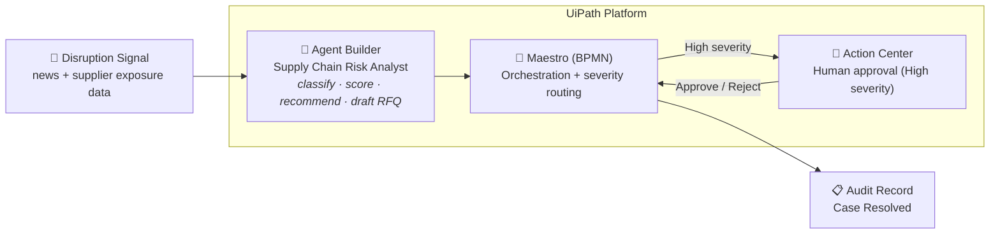
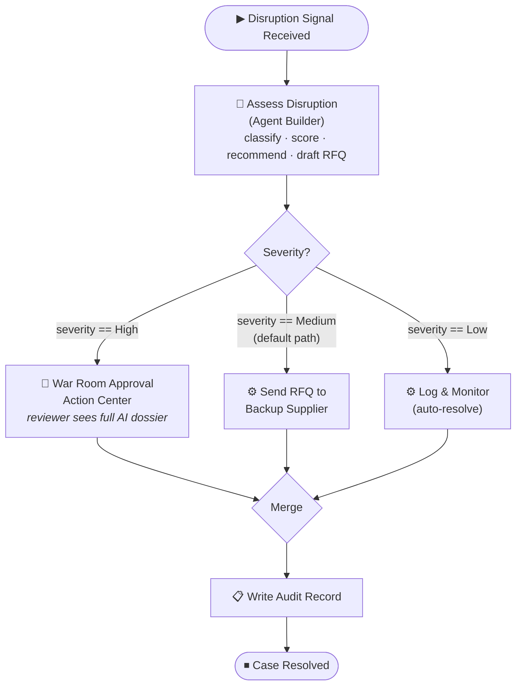
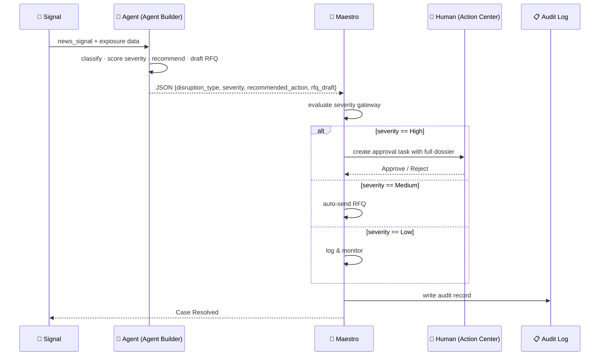

# Supply Chain Disruption War Room

**UiPath AgentHack 2026 — Track 2: UiPath Maestro BPMN**
**Builder:** Manikandan M

An autonomous, governed agentic system that turns a supplier-disruption signal into a
scored decision and a ready-to-send recovery action in seconds — while keeping humans
in control of high-stakes calls. Built end-to-end on UiPath.

---

## 🎬 Demo

- **Demo video:** <PASTE YOUR YOUTUBE LINK HERE>
- **Devpost:** <PASTE YOUR DEVPOST PROJECT LINK HERE>

---

## ⚡ Problem

When a supplier's plant catches fire (or floods, or goes bankrupt), the clock starts
immediately — but the human response doesn't. Buyers often learn of a disruption hours
or days late, then scramble across spreadsheets and email to answer three questions:
**How bad is it? What do we do? Who signs off?** By the time the answer arrives, the
production line is already down.

**Supply Chain Disruption War Room** closes that gap from days to seconds — without
removing the human from the loop on high-impact decisions.

---

## 🏗️ Architecture

High-level view — a disruption signal flows through three UiPath services and ends in a
fully auditable resolution:



---

## 🤖 What it does

Given a disruption signal and the affected supplier's exposure data, an AI agent runs a
four-step analysis, then a Maestro process acts on the result autonomously:

1. **Classifies** the disruption — `fire | flood | bankruptcy | port disruption | labor strike | geopolitical | quality recall | other`
2. **Scores severity** from revenue-at-risk and days-to-stockout — `High | Medium | Low`
3. **Recommends an action** — switch to a named backup supplier / expedite freight / monitor
4. **Drafts a complete, send-ready RFQ email** to the backup supplier (correct part, quantity, lead time)

---

## 🔀 Process Flow (Maestro BPMN)



Every path ends in an **audit record** — full traceability regardless of outcome.

---

## 🔁 Decision Sequence

How a single high-severity case flows through the system:



---

## 🧩 UiPath Components Used

| Component | Role |
|---|---|
| **UiPath Agent Builder** | The autonomous *Supply Chain Risk Analyst* agent — performs the 4-step reasoning and returns strict JSON (`disruption_type`, `severity`, `recommended_action`, `rfq_draft`). |
| **UiPath Maestro (BPMN)** | Orchestrates the whole process: the agent task, the severity gateway, automated service tasks, the human approval task, a merge, and an audit step — with a default-path safety net. |
| **UiPath Action Center** | The human-in-the-loop approval app (`SimpleApprovalApp`) — shows the reviewer the agent's full dossier (including the drafted RFQ) with one-click Approve / Reject. |
| **UiPath Studio Web** | Authoring environment for the agent and the Maestro process. |
| **UiPath Automation Cloud / Orchestrator** | Hosting, publishing, and execution of the solution. |

---

## 🏷️ Agent Type

**Low-code Agent** (built with UiPath Agent Builder).
The agent uses a structured system prompt and a strict JSON output schema; it is invoked
as an Agent task inside a Maestro BPMN process. No Coded Agents are used.

---

## 📐 Agent specification

**Inputs:** `news_signal`, `supplier_name`, `part_name`, `units_on_hand`, `daily_usage`,
`days_to_stockout`, `revenue_at_risk`

**Outputs (strict JSON):** `disruption_type`, `severity`, `recommended_action`, `rfq_draft`

**Severity rules (first match wins):**
- **High** — `revenue_at_risk >= 1,000,000` OR `days_to_stockout <= 14`
- **Medium** — `revenue_at_risk >= 100,000` OR `days_to_stockout <= 45`
- **Low** — all other cases

The agent's full system prompt is in [`/agent/system_prompt.md`](agent/system_prompt.md).

---

## 🚀 Setup Instructions (for judging)

> The solution is a low-code UiPath build. To run it, recreate the three artifacts in a
> UiPath Automation Cloud tenant (Agent Builder, Maestro, Action Center all enabled).

1. **Enable services** — In UiPath Automation Cloud → Admin → Tenant → Services, ensure
   **Orchestrator**, **Maestro**, and **Action Center (Actions)** are enabled.

2. **Create the agent** — In Studio Web, create an Autonomous Agent. Paste the prompt
   from [`/agent/system_prompt.md`](agent/system_prompt.md) and set the output schema to
   the four fields above. **Publish** it.

3. **Build the Maestro process** — Create a Maestro BPMN process with this flow:
   `Start → Agent task (Assess Disruption) → Exclusive gateway (Severity?) → {High: human approval, Medium: send RFQ, Low: log & monitor} → Merge → Write audit → End`.
   - Bind the Agent task to the published agent; map its outputs to process-level variables.
   - Gateway conditions: `severity == "High"`, `severity == "Medium"`, `severity == "Low"` (Medium = default path).
   - The High-branch user task creates an Action Center app task (`SimpleApprovalApp`) and passes the dossier into the **Content** input.

4. **Run it** — Use **Debug** in Studio Web with sample inputs, e.g.:
   ```
   news_signal:       Apex Components plant fire halts production
   supplier_name:     Apex Components
   part_name:         Hydraulic Valve
   units_on_hand:     1200
   daily_usage:       110
   days_to_stockout:  11
   revenue_at_risk:   2400000
   ```
   This produces **High** severity → routes to **Action Center** → approve the task →
   the case resolves with a full audit trail.

   Try `days_to_stockout: 30, revenue_at_risk: 300000` for the **Medium** branch, and
   `days_to_stockout: 60, revenue_at_risk: 50000` for the **Low** branch.

---

## 📂 Repository contents

```
agent/system_prompt.md     # The Agent Builder system prompt + output schema
docs/                      # Screenshots of the Maestro process, Action Center, run trails
warroom/                   # Supporting Python services (mock ERP, scoring, live-news cockpit)
README.md
```

> The `warroom/` Python services are an optional companion "cockpit" (mock ERP data, a
> deterministic scoring reference, and a live-news feed) used during design and for local
> experimentation. The graded submission is the UiPath low-code solution described above.

---

## 🔮 What's next

Live news ingestion, real-time ERP inventory feeds, SLA auto-escalation on approvals, and
automated post-mortems.

---

## 👤 Author

**Manikandan M** — mmani786ms@gmail.com

Built for **UiPath AgentHack 2026**.
